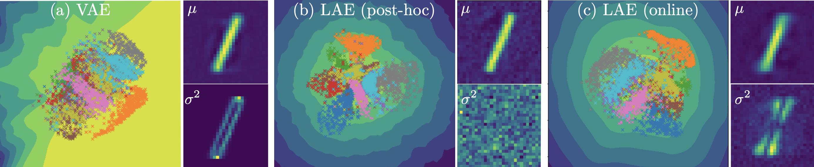
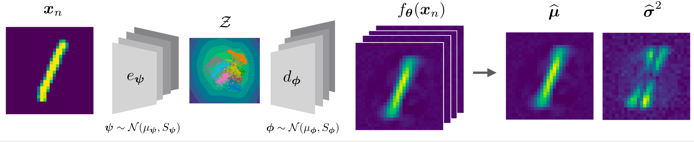
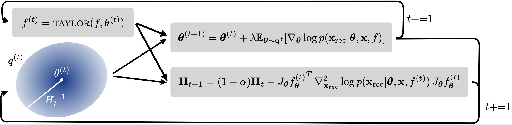
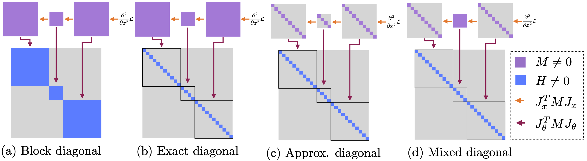

# Laplacian Autoencoder (LAE)

Official code for ***Laplacian Autoencoders for Learning Stochastic Representations*** and the associate baseline methods. 

Paper [INSERT LINK]



Tldr; We present an online sampling-based training procedure for the laplace approximation that results in well-calibrated uncertainties for autoencoders both in latent and output space.

### Abstract

Established methods for unsupervised representation learning such as variational autoencoders produce none or poorly calibrated uncertainty estimates making it difficult to evaluate if learned representations are stable and reliable. In this work, we present a Bayesian autoencoder for unsupervised representation learning, which is trained using a novel variational lower-bound of the autoencoder evidence. This is maximized using Monte Carlo EM with a variational distribution that takes the shape of a Laplace approximation. We develop a new Hessian approximation that scales linearly with data size allowing us to model high-dimensional data. Empirically, we show that our Laplacian autoencoder estimates well-calibrated uncertainties in both latent and output space. We demonstrate that this results in improved performance across a multitude of downstream tasks.


## Model overview

We put a Gaussian distribution over the weights of both the encoder and the decoder. This allow use to sample NN and deduce uncertainties in both the latent and output space. 



##  Sampling-based online training
Our work is inspired by the Laplace approximation, where a Gaussian distribution is place over the parameters. This Gaussian's covariance is the inverse of the second order derivate. We propose an online-sampling based training procedure, where we recursively sample a NN, compute the gradient and second order gradient, which we use to update the covariance estimate and mean parameters.


## Hessian approximations
We propose two new approximations of the Generalized Gauss Newton approximation, namely ***approx*** and ***mix***. These approximations enable computation of the hessian on large images. The chosen approximations can be specified from the config files.


## Setup

```bash 
# Clone repo and enter
git clone https://github.com/FrederikWarburg/LaplaceAE;
cd LaplaceAE;

# Install Pytorch, see https://pytorch.org/get-started/locally/ for more instuctions
conda install pytorch==1.10.1 torchvision==0.11.2 torchaudio==0.10.1 cudatoolkit=10.2 -c pytorch

# Install package requirements
pip install -r requirements.txt

# Clone specialized version of stochman
git clone https://github.com/MachineLearningLifeScience/stochman;
cd stochman;
python setup.py install;
```

This should give you a folder structure like this:

    LAPLACEAE
    ├── stochman            # Support different hessian computations
    ├── configs             # config files, organised by experiments
    ├── figures             # generated figures
    ├── src                 # source code
    │   ├── hessian         # Code for computing hessians
    │   ├── models          # Model architechtures
    |   ├── utils.py        # helper functions
    |   ├── visualizer.py   # visualization functions
    |   ├── data.py         # data loaders
    |   ├── data_imputation # code for data imputation experiments
    │   └── trainer_*.py    # files for training the actual models
    └── requirements.txt    # file containing python packages that are required to run code

## Train & Test

To train and test, you can call: 

```bash
cd src; 
CUDA_VISIBLE_DEVICES=0 python trainer_[INSERT MODEL].py --config PATH_TO_CONFIG
```
For example to train online LAE on mnist and evaluate on kmnist 
```bash
cd src; 
CUDA_VISIBLE_DEVICES=0 python trainer_lae_elbo.py --config ../configs/ood_experiments/mnist/linear/lae_elbo.yaml
```
and try train a VAE

```bash
cd src; 
CUDA_VISIBLE_DEVICES=0 python trainer_vae.py --config ../configs/ood_experiments/mnist/linear/vae.yaml
```

You can monitor training on tensorboard
```bash
tensorboard --logdir lightning_log --port 6006
```

To test on missing data imputation experiments, you can call. This require that you have a trained model.

```bash
cd src/data_imputation; 
CUDA_VISIBLE_DEVICES=0 python lae.py
```
or

```bash
cd src/data_imputation; 
CUDA_VISIBLE_DEVICES=0 python vae.py
```

## Citation

If you use this code, please consider citing our work

```bibtex
@article{LAE2022,
  title={Laplacian Autoencoders for Learning Stochastic Representations},
  author={Marco Miani and Frederik Warburg and Pablo Moreno-Muñoz and Nicki Skafte Detlefsen and Søren Hauberg},
  journal={CoRR},
  year={2022}
}
```

```bibtex
@article{software:stochman,
  title={StochMan},
  author={Nicki S. Detlefsen and Alison Pouplin and Cilie W. Feldager and Cong Geng and Dimitris Kalatzis and Helene Hauschultz and Miguel González Duque and Frederik Warburg and Marco Miani and Søren Hauberg},
  journal={GitHub. Note: https://github.com/MachineLearningLifeScience/stochman/},
  year={2021}
}
```
