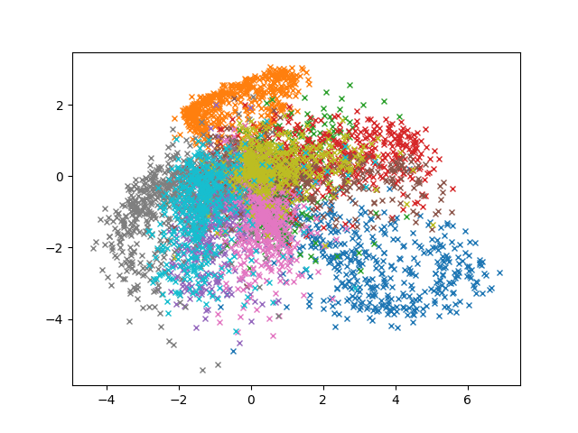
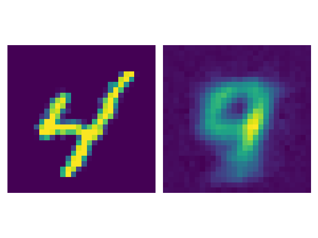
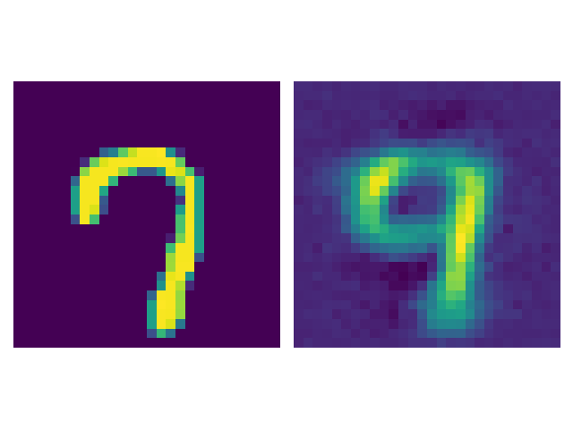
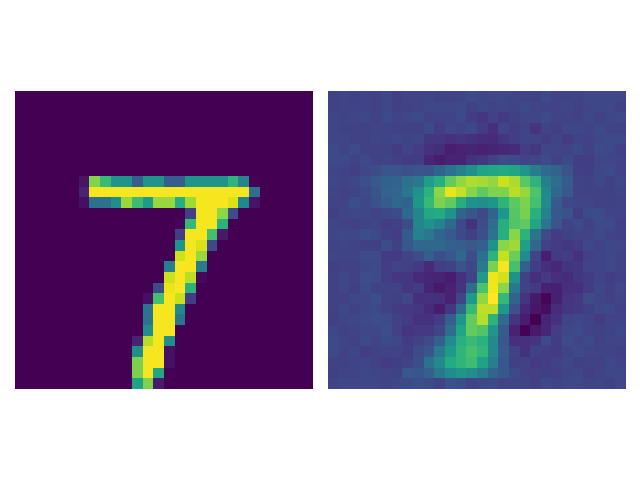
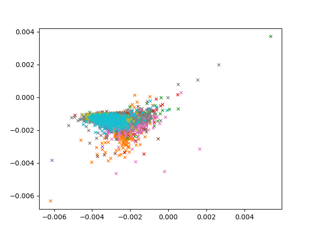

# Results

We have conducted experiments for the following models. 

Models:
- AE
  - MSE
  - NLL
- VAE
- AE dropout
- LAE post hoc
  - decoder only
  - entire model
- LAE elbo

For each model, we compute the following metrics and or figures:

Figures:
- Output space:
   - Mean and variance of reconstruction of in-distribution (ID) examples
   - Mean and variance of reconstruction of out-of-distribution (OOD) examples
   - Distristribution of variances for ID and OOD examples
   - [TODO: Distribution of likelihood for ID and OOD examples]
   - [TODO: ROC curves for ID and OOD examples]
- Latent space:
   - Mean embedding space on top of contour grid of variances
   - Ellipoid of latent embeddings for ID and OOD exampels.

Metrics:
- Output space:
   - [TODO: MSE]
   - [TODO: Likelihood]
- Latent space:
   - [TODO: some geodesic stuff?]

## LAE

<table>
  <tr>
    <td>Encoder uncertainties</td>
     <td>Decoder uncertainties</td>
  </tr>
  <tr>
   <td>
    <td></td>
    </td>
  </tr>
  <tr>
    <td></td>
    <td></td>
  </tr>
</table>

<table>
  <tr>
    <td>In distribution</td>
     <td>Out-of-distribution</td>
  </tr>
  <tr>
    <td></td>
    <td></td>
  </tr>
  <tr>
    <td></td>
    <td></td>
  </tr>
  <tr>
    <td></td>
    <td></td>
  </tr>
  <tr>
    <td></td>
    <td></td>
  </tr>
  <tr>
    <td></td>
    <td></td>
  </tr>
 </table>

## LAE post hoc [Encoder & Decoder]

<table>
  <tr>
    <td>Encoder uncertainties</td>
     <td>Decoder uncertainties</td>
  </tr>
  <tr>
   <td>
    <td></td>
    </td>
  </tr>
  <tr>
    <td></td>
    <td></td>
  </tr>
</table>

<table>
  <tr>
    <td>In distribution</td>
     <td>Out-of-distribution</td>
  </tr>
  <tr>
    <td></td>
    <td></td>
  </tr>
  <tr>
    <td></td>
    <td></td>
  </tr>
  <tr>
    <td></td>
    <td></td>
  </tr>
  <tr>
    <td></td>
    <td></td>
  </tr>
  <tr>
    <td></td>
    <td></td>
  </tr>
 </table>

## LAE post hoc [Only Decoder]

<table>
  <tr>
    <td>Encoder uncertainties</td>
     <td>Decoder uncertainties</td>
  </tr>
  <tr>
   <td>
    <td></td>
    </td>
  </tr>
  <tr>
    <td></td>
    <td></td>
  </tr>
</table>

<table>
  <tr>
    <td>In distribution</td>
     <td>Out-of-distribution</td>
  </tr>
  <tr>
    <td></td>
    <td></td>
  </tr>
  <tr>
    <td></td>
    <td></td>
  </tr>
  <tr>
    <td></td>
    <td></td>
  </tr>
  <tr>
    <td></td>
    <td></td>
  </tr>
  <tr>
    <td></td>
    <td></td>
  </tr>
 </table>

## AE [MSE]

<table>
  <tr>
    <td>Encoder uncertainties</td>
     <td>Decoder uncertainties</td>
  </tr>
  <tr>
   <td>
    <td></td>
    </td>
  </tr>
  <tr>
    <td></td>
    <td></td>
  </tr>
</table>

<table>
  <tr>
    <td>In distribution</td>
     <td>Out-of-distribution</td>
  </tr>
  <tr>
    <td></td>
    <td></td>
  </tr>
  <tr>
    <td></td>
    <td></td>
  </tr>
  <tr>
    <td></td>
    <td></td>
  </tr>
  <tr>
    <td></td>
    <td></td>
  </tr>
  <tr>
    <td></td>
    <td></td>
  </tr>
 </table>

## AE [NLL]

<table>
  <tr>
    <td>Encoder uncertainties</td>
     <td>Decoder uncertainties</td>
  </tr>
  <tr>
   <td>
    <td></td>
    </td>
  </tr>
  <tr>
    <td></td>
    <td></td>
  </tr>
</table>

<table>
  <tr>
    <td>In distribution</td>
     <td>Out-of-distribution</td>
  </tr>
  <tr>
    <td></td>
    <td></td>
  </tr>
  <tr>
    <td></td>
    <td></td>
  </tr>
  <tr>
    <td></td>
    <td></td>
  </tr>
  <tr>
    <td></td>
    <td></td>
  </tr>
  <tr>
    <td></td>
    <td></td>
  </tr>
 </table>

## AE [MC-DROPOUT]

## VAE [Sampling]

<table>
  <tr>
    <td>Encoder uncertainties</td>
     <td>Decoder uncertainties</td>
  </tr>
  <tr>
   <td>
    <td></td>
    </td>
  </tr>
  <tr>
    <td></td>
    <td></td>
  </tr>
</table>

<table>
  <tr>
    <td>In distribution</td>
     <td>Out-of-distribution</td>
  </tr>
  <tr>
    <td></td>
    <td></td>
  </tr>
  <tr>
    <td></td>
    <td></td>
  </tr>
  <tr>
    <td></td>
    <td></td>
  </tr>
  <tr>
    <td></td>
    <td></td>
  </tr>
  <tr>
    <td></td>
    <td></td>
  </tr>
 </table>

## VAE [Variance Decoder]

<table>
  <tr>
    <td>Encoder uncertainties</td>
     <td>Decoder uncertainties</td>
  </tr>
  <tr>
   <td>
    <td></td>
    </td>
  </tr>
  <tr>
    <td></td>
    <td></td>
  </tr>
</table>

<table>
  <tr>
    <td>In distribution</td>
     <td>Out-of-distribution</td>
  </tr>
  <tr>
    <td></td>
    <td></td>
  </tr>
  <tr>
    <td></td>
    <td></td>
  </tr>
  <tr>
    <td></td>
    <td></td>
  </tr>
  <tr>
    <td></td>
    <td></td>
  </tr>
  <tr>
    <td></td>
    <td></td>
  </tr>
 </table>

